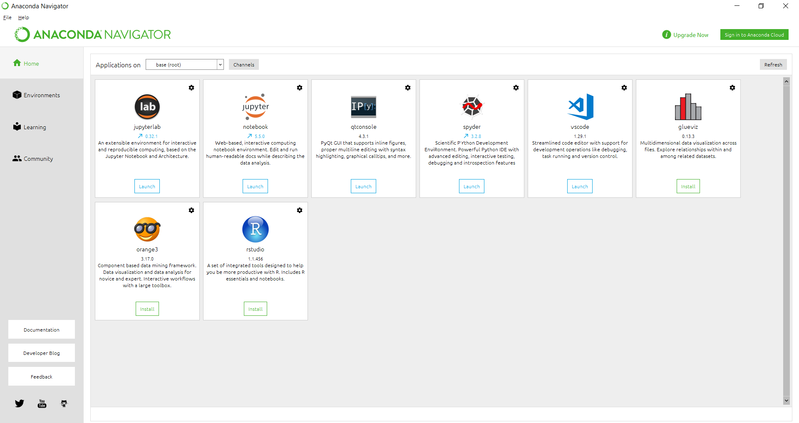
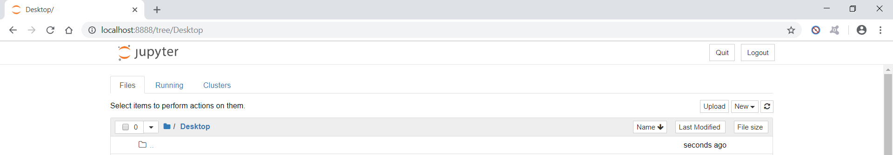
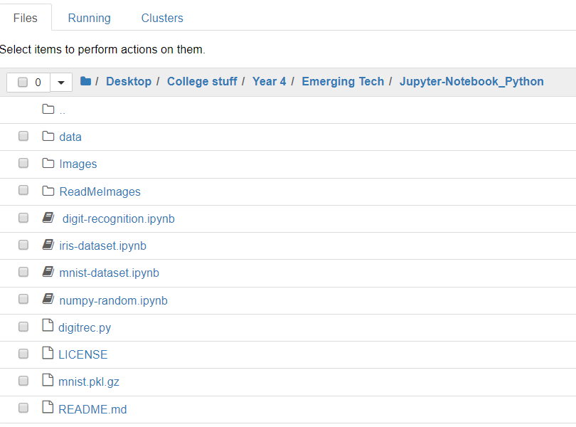

# Emerging Technologies

The repository contains my 4th year emerging technologies project which consists of 4 jupyter notebook, 1 python script and an images folder.

* Requirements
* Overview
* Code
* Resources and References

## Requirements

### 1. numpy random notebook: 
Ajupyter notebook explaining the conceptsbehindandtheuseofthenumpyrandompackage,includingplots of the various distributions.

### 2. Iris dataset notebook: 
A jupyter notebook explaining the famous iris data set including the difficulty in writing an algorithm to separate the three classes of iris based on the variables in the dataset. 

### 3. MNIST dataset notebook: 
A jupyter notebook explaining how to read the MNIST dataset efficiently into memory in Python.

### 4. Digit recognition script: 
A Python script that takes an image file containing a handwritten digit and identifies the digit using a supervised learning algorithm and the MNIST dataset. 

### 5. Digit recognition notebook: 
A jupyternotebook explaining how the above Python script works and discussing its performance.

## Overview

### Anaconda 

Anaconda is a free and open-source distribution of the Python and R programming languages for data science and machine learning applications (large-scale data processing, predictive analytics, scientific computing), that aims to simplify package management and deployment.

To install anaconda visit https://www.anaconda.com/download/ and follow the tutorial. Once that is completed to run these notebooks you will need to install the following packages through anaconda command prompt:  

scit-learn: conda install -c anaconda scikit-learn 

Pillow: conda install -c anaconda pillow

Mathplotlib: conda install -c conda-forge matplotlib 

Keras: conda install -c conda-forge keras 

Tensorflow: conda install -c conda-forge tensorflow 

### Python

Python is an interpreted high-level programming language for general-purpose programming. Created by Guido van Rossum and first released in 1991, Python has a design philosophy that emphasizes code readability, notably using significant whitespace. In this project I have used python in the jupyter notebooks and a python script developed in visual studio code. It can edited from and text editor. To run the python script navigate to the file directory and open a command prompt and run the command "python digitrec.py".

### Jupyter

Project Jupyter is a nonprofit organization created to "develop open-source software, open-standards, and services for interactive computing across dozens of programming languages." Spun-off from IPython in 2014 by Fernando Pérez, Project Jupyter supports execution environments in several dozen languages.

## Code
To run this project you will first need to either download and unzip the zip file or clone this repository by running:

  git clone https://github.com/NiallD565/Jupyter-Notebook_Python.git

Next you will need to start the anaconda navigator once it has loaded click launch on the jupyter notebook.

A new tab/window will open running on local host then open you can navigate to the folder through the directory here. Once you have successfully navigated to the file click on one of the notebooks which end in the file extension ".pynb".

The notebook will then open in a new tab.

## Resources and References

<ul>
   <li>[1] <a href="https://github.com/ianmcloughlin/jupyter-teaching-notebooks/blob/master/pandas-with-iris.ipynb"> Project Brief</a></li>
   <li>[2] <a href="https://www.python.org/doc/essays/blurb/">Python</a></li>
   <li>[3] <a href="http://jupyter.org/">Jupyter</a></li>
   <li>[4] <a href="https://jupyter-notebook.readthedocs.io/en/latest/notebook.html">Jupyter Notebook Docs</a></li>
   <li>[5] <a href="https://www.anaconda.com/">Anaconda</a></li>
  
</ul>

# End
